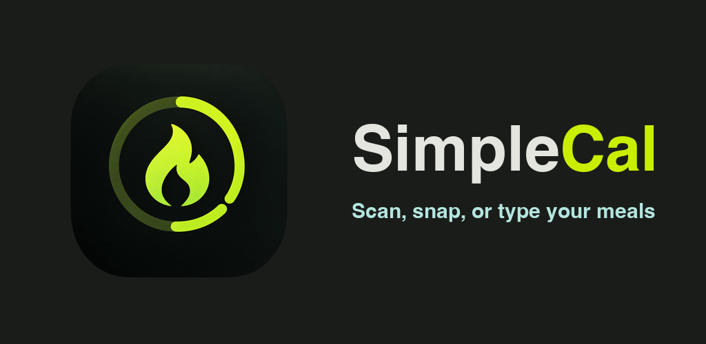
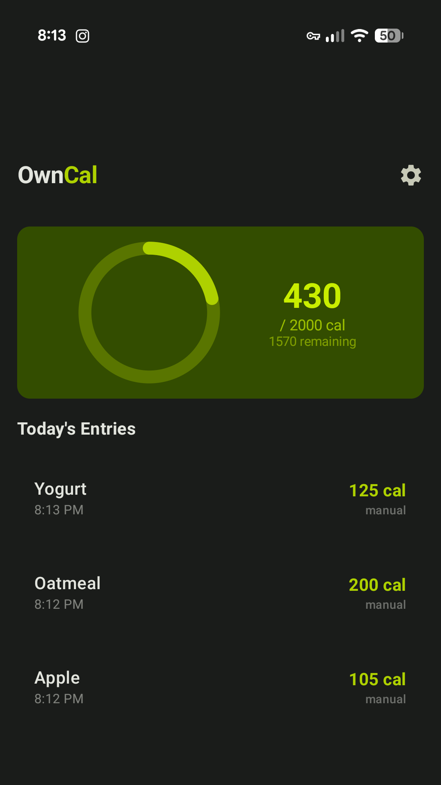
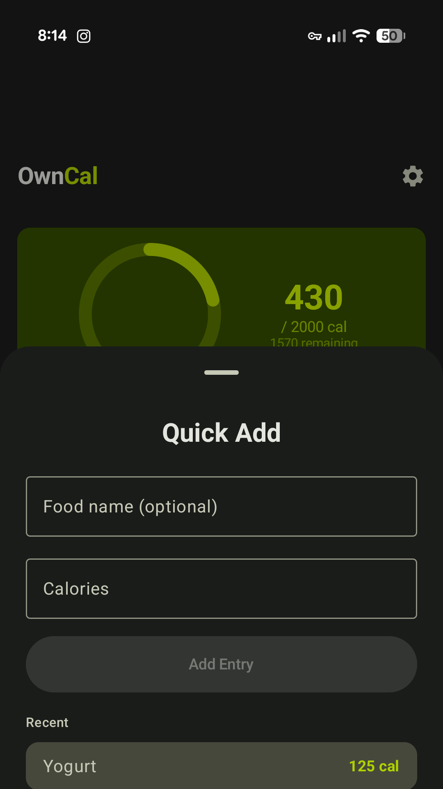
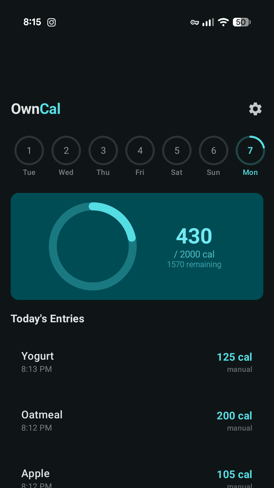

# SimpleCal

A fast, private calorie tracker. No ads, no accounts, no analytics — your data never leaves your phone.

<table>
  <tr>
    <td align="center"> Today view</td>
    <td align="center"> Quick add</td>
    <td align="center"> Weekly history</td>
  </tr>
</table>

## What it does

- Log a meal in seconds — scan a product barcode, snap a photo of your meal, or just type it
- Daily calorie goal with a progress ring, a today view, and a swipeable 7-day history
- Home screen widget with today's progress and one-tap quick actions
- Opt-in calorie sync to Google Health Connect
- Export and import all of your data as CSV — it's yours

## Privacy

SimpleCal collects no data. There is no account, and no server of ours that the app talks to. Everything is stored locally on your device, and you can export it or delete it at any time.

[Read the full privacy policy →](https://github.com/GrixDesigns/SimpleCal/wiki/Privacy-Policy)

## Get the app

SimpleCal is available on [Google Play](https://play.google.com/store/apps/details?id=com.grixdesigns.simplecal).

---

This repository intentionally contains no code — it exists to host the SimpleCal privacy policy in the [wiki](https://github.com/GrixDesigns/SimpleCal/wiki).
